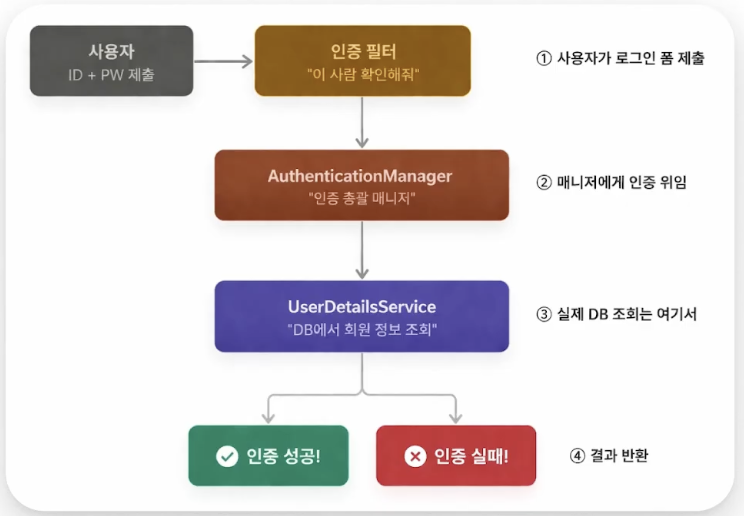
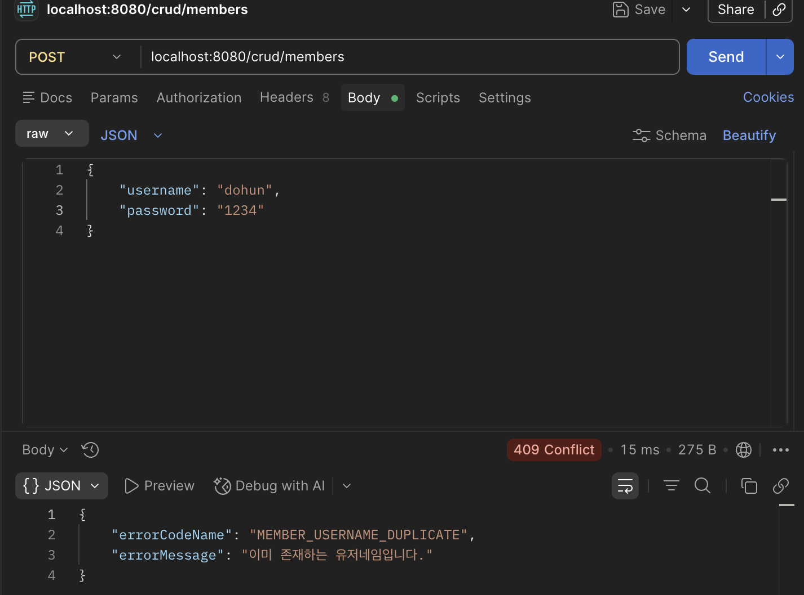
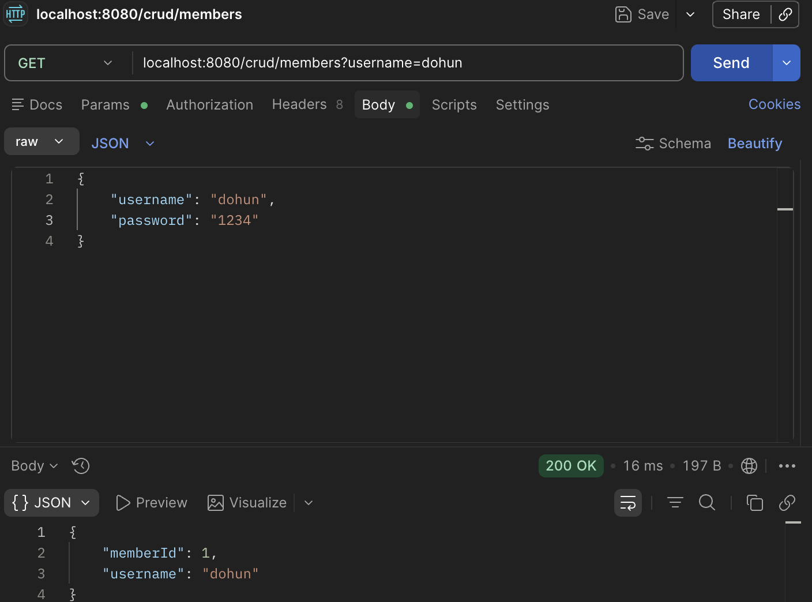
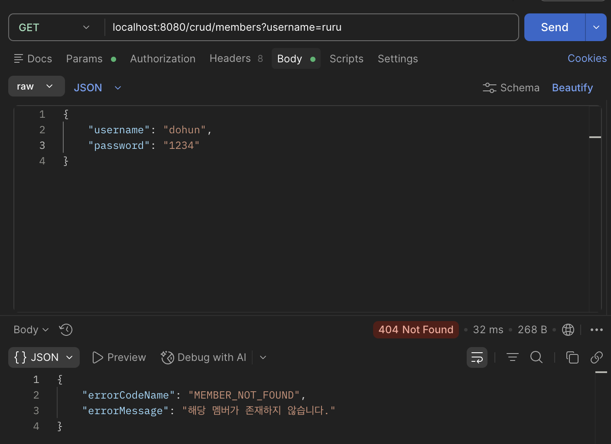
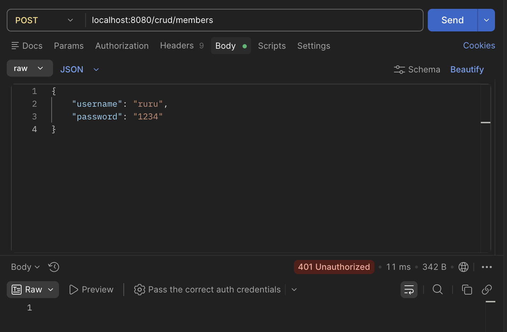

## 용어

인증 (Authentication) : 사용자의 신원 확인, 로그인

인가 (Authorization) : 인증된 사용자가 어떤 권한을 가지는지 판단, 관리자만 접근 가능한 페이지 등

# Spring Security

Spring Security가 바로 자바 웹 애플리케이션의 인증과 인가를 담당하는 보안 프레임워크이다.



## Servlet Filter - SecurityFilterChain

Controller로 가려는 HTTP의 요청 / 응답을 가로채서 전처리 / 후처리를 해주는 장치이다. 로그인도 체크하고, 토큰도 검사하고 등등 문제가 있는지 없는지 검사한다.

### 접근 제어

이 경로에 접근할 권한이 있는지 판단한다. 예시로 다음 코드를 보면.

```java
http
        .authorizeHttpRequests(auth -> auth
        .requestMatchers("/admin/**").hasRole("ADMIN")
		.requestMatchers("/mppage/**").authenticated()
		.anyRequest().permitAll()
	);

```

/admin API 호출은 hasRole(”ADMIN”)에 따라 ADMIN 역할만 접근이 가능하고, /mypage API는 authenticated()에 따라 로그인한 사람만 접근이 가능하며, 그 외 anyRequest는 permitAll()에 따라 누구나 접근 가능하다.

## 코드 작성 흐름

### getMembers() 완성하기

1. repository 계층을 정의한다. interface로 정의하고 extends를 통해 JpaRepository를 불러온다. 불러올 때는<> 안에 접근할 Entity인 Member와 접근할 id 변수인 Long을 써 <Member, Long>으로 선언한다.
2. 서비스 계층에서 private final로 MemberRepository 객체를 선언해준다. 그 후 getMembers에 모든 멤버를 가져오도록 memberRepository를 이용해준다.
3. memberRepository에서 findAll() 메서드를 불러온다. JpaReposiroty에 findAll()이 이미 선언되어 있으므로 우리가 따로 만들지 않았음에도 불구하고 오류가 나지 않음을 확인할 수 있다. 이렇게 가져온 정보들은 members 리스트로 받는다.
4. 받아온 members 속 member의 정보들을 받아오기 위해 미리 준비되어 있는 DTO를 활용한다. MemberInfoResponse의 객체 response로 DTO의 응답을 받는다.
5. 응답을 선언되어 있는 MemberInfoResponse형식 list에 add한 후 list를 리턴한다.

### getMemberByUsername() 완성하기

1. 이번에도 repository를 이용하여 findByUsername을 불러오려고 했지만, 이 메서드는 선언되어 있지 않다. 이러한 경우에는 직접 메서드를 만들어야 한다. 이런 세세한 메서드는 Spring Data JPA에서 정의되어 있지 않으니, repository 계층에서 직접 만들어주자.
2. repo에서 Member 반환형 findByUsername을 선언하고 매개변수로 String 타입의 username을 받는 메서드를 선언하였다.
3. 선언만 하고 정의를 하지 않았지만, 서비스 계층에서 문제없이 동작하고 기능 역시 완벽하게 수행한다. JPA의 특징은, 직접 SQL문을 작성할 필요 없이 메서드명으로 JPA가 알아서 JPQL을 짜 줘서 기능을 수행해주는 것에 있다. 이 기능을 Query Creation이라고 한다. https://docs.spring.io/spring-data/jpa/reference/jpa/query-methods.html#jpa.query-methods.query-creation 여기 링크를 보면 네이밍에 대한 다양한 기능들을 소개하고 있다. distinct 이런것도 있다.
4. 만약 멤버가 존재하지 않으면 오류 코드를 반환하는데, 프로젝트 트랙에서 만들었둣이 커스텀 예외를 선언한다.
5. member를 Response DTO로 감싸 반환한다.

### createMember()는?

중복되는 유저네임이 있으면 에러를 반환하기로 했다. 중복 여부 판단을 위해 boolean 타입의 변수를 선언하고 중복을 찾는 레포를 만들면 될 것 같다. 이 때 메서드명에 exists를 추가하면 boolean 타입 반환을 할 수 있다.

이제 서비스 계층에서 위에서 선언한 메서드를 사용해야 한다. 매개변수로 username을 불러와야 하지만 private로 선언된 username을 바로 사용할 순 없다. 따라서 메서드를 이용해야 하는데, getUsername(); 을 이용하면 된다. getUsername을 DTO에서 선언하지 않았지만, @Getter 어노테이션과 Lombok 플러그인 덕분에 어노테이션만 달아도 편리하게 private 변수를 불러올 수 있다. (@Setter를 쓰면 private 변수의 내용을 바꿀 수 있다. 하지만 주의해서 사용해야 한다.)

### updateMember()

Id를 이용해 해당 멤버를 찾아와야 한다. JPA 내부 메서드에 findById()가 이미 선언되어 있지만, 타입이 Optional로 선언되어 있다. 우리는 Member라는 임의의 객체를 만들었기 때문에 타입이 달라 오류가 난다. Optional이란 값이 null일 때를 대비한 타입인데…

- Optional : 만약 기존 방식대로 Member를 이용한다면 id에 해당하는 멤버가 없을 경우 null이 저장될 것이다. Member 객체 member가 null인걸 체크하지 않는다면 NullPointerException이 호출될 것이다. 이를 막기 위해 Optional 객체는 이 객체의 값이 있을 수도 있고 없을 수도 있다는 가능성을 포함한다. 개발자는 이제 null 예외처리를 반드시 해야 함으로써 중대한 에러를 강제적으로 막게 된다. (그렇다고 남용하면 안 된다. 이펙티브 자바 - Optional 반환은 신중히 하라. 참고)

혹은 Optional을 사용하여 예외처리를 하지 않고, Member로 받는 대신 orElseThrow를 사용하여도 된다. orElseThrow에서 람다형을 이용해 객체가 비었다면 CustomException의 MEMBER_NOT_FOUND를 생성하여 예외 처리를 한 번에 할 수 있다. 이런 식으로.

```java
Member member = memberRepository.findById(memberId)
        .orElseThrow(() -> new CustomException(MEMBER_NOT_FOUND));
```

### deleteMember

JPA 레포에 delete가 이미 구현되어 있으므로 그냥 사용하면 된다.

### Test


POST로 dohun을 생성한 뒤, 다시 username이 dohun인 회원을 POST 시도 시 409 confllict 에러가 정상적으로 반환된다.



parameter를 이용한 단건 조회



member가 없다면 404가 뜨게 된다.

## build.gradle에서 security 활성화



POST시 401 Unauthorized 에러가 뜨게 된다.

localhost:8080으로 로컬에서 직접 로그인하게 되면 자동으로 기본 로그인 페이지를 생성해 준다. 이 기본 로그인 페이지를 커스터마이징 하는 과정은 다음 시간부터 진행하게 된다.