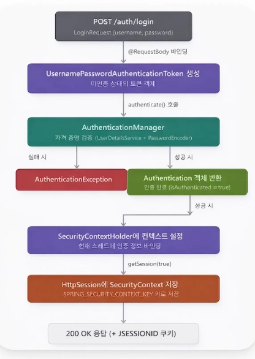

SecurityFilterChain을 커스터마이징 한다면, 기본 로그인 창이 뜨지 않게 된다.

기본 로그인 창에서 기본 아이디인 admin과 콘솔창에 뜬 비번을 입력해서 로그인을 해 준다면, 일정 시간 동안은 [localhost:8080](http://localhost:8080) 을 통해 재접속 하더라도 아이디, 비번을 요구하지 않고 바로 로그인 된다. 쿠기 란에서 보면 JSESSIONID=B0521FD75DEC7AA82F5B43EA323DCDCD

로 세션 방식 로그인이 적용되었음을 알 수 있음.

지금부터 SecurityFilterChain을 등록한다.

### SecurityFilterChain

global에 config 패키지를 만든 뒤 WebSecurifyConfig 클래스를 생성한다. @Configuration과 @EnableWebSecurity 어노테이션을 붙여주고, SecurityFilterChain 객체인 filterChain의 매개변수에 HttpSecurity 객체인 http를 넘겨준다. HttpSecurity 빈은 HttpSecurityConfiguration 클래스에 정의되어있다. 이 객체는 싱글턴인데, 싱글턴 객체란 어디서 주입받던 동일한 인스턴스를 사용하는 객체이다. 즉, 애플리케이션 전체에서 단 하나만 존재하는 객체이다. 따라서 설정용 객체 HttpSecurity를 이용하여 SecurityFilterChain에서 싱글턴 빈으로 등록된다. HttpSecurity에서 보안 설정을 해줄 수 있다. 인증/인가 규칙도 설정하고, URL 접근 권한도 설정하고, 로그인 방식도 정의할 수 있다.

정리하면, HttpSecurity에서 내가 원하는 보안 설정을 해 준 다음에, 보안 설정을 마친 후 HttpSecurity객체 http를 SecurityFilterChain에 등록하여 운영하는 것이다. 반환은 http.build(); 로 진행한다.

### MemberRole 정의

엔티티 계층에 MemberRole Enum 클래스 생성

```java
@Getter
@RequiredArgsConstructor
public enum MemberRole {
    // ROLE 접두사를 붙인다.
    REGULAR("ROLE_REGULAR"),
    ADMIN("ROLE_ADMIN");

    private final String value;
}
```

- ROLE 접두사 : 사용자 권한이 일반적인 권한(Authority)이 아닌 역할(Role)에 따라 나뉘는 권한임을 명시하기 위해 필수적으로 사용하는 접두어이다. ROLE은 사용자의 신분, 그룹을 의미한다. 이 사람이 어떤 부류인지, 그 부류에 따라 어떤 권한을 할당받았는지를 정하기 위해 ROLE 접두사를 사용한다.

수정된 Member 클래스

```java
@Enumerated(EnumType.STRING)
    private MemberRole role;

    public Member(String username, String password, MemberRole role) {
        this.username = username;
        this.password = password;
        this.role = role;
    }
```

이제 서비스 계층에서 회원가입 하는 User의 정보에 MemberRole.REGULAR를 추가로 넣어주면 된다.

filterChain

```java
public SecurityFilterChain filterChain(HttpSecurity http) throws Exception {
        http
                // 기본 폼 로그인 비활성화
                .formLogin(formLogin -> formLogin.disable())
                .httpBasic(httpBasic -> httpBasic.disable())
                // csrf는 켜 주는 게 좋지만, 테스트 환경에서는 disable
                .csrf(csrf -> csrf.disable())
                // 세션 정의
                .sessionManagement(session -> session
                        .sessionCreationPolicy(SessionCreationPolicy.IF_REQUIRED))
                // 멤버의 권한 정의
                .authorizeHttpRequests(auth -> auth
                        .requestMatchers("/auth/signup", "/auth/login").permitAll()
                        .requestMatchers("/crud/members/**").hasAnyRole("REGULAR")
                        .anyRequest().authenticated());

        return http.build();
    }
}
```

1. 기본 로그인 방식을 전부 disable한다. 직접 로그인 API 만들어서 처리한다.
2. CSRF 보호를 끈다. 실 서비스에서는 보통 켜거나 JWT를 사용하지만, 개발이나 테스트 과정에서는 꺼야 편하다.
3. 세션 정책을 정의한다.
4. 권한을 설정한다. 멤버의 권한 정의를 위해 authorizeHttpRequests를 열어 주고, 각각의 엔드 포인트에 대해 권한을 설정해 준다. signup과 login에서는 모두 허가하고, members에 관련된 http 요청은 REGULAR, 그 밖의 요청은 로그인만 하면 접근이 가능하게 한다.

패스워드를 평문으로 저장하고 있으므로 암호화를 한다.

```java
@Bean
public PasswordEncoder passwordEncoder() {
    return new BCryptPasswordEncoder();
}
```

```java
// request를 record로 변경함.
String encoded = passwordEncoder.encode(request.password());
Member member = new Member(request.username(), encoded, MemberRole.REGULAR);
```

## 로그인 과정



1. 로그인 요청을 authToken으로 변환한다.
2. AuthenticationManager로 인증한다. 인증할 때는 1에서 변환한 authToken을 이용하여 인증하는데, 실패 시 AuthenticationException을 던진다.
3. 현재 인증 정보를 저장한다. 이 때 SecurityContext가 이용된다.
4. 세션을 생성하고 JSESSIONID를 발급한다.
5. 세션에 인증 정보를 저장한다.

### CustomUserDetailsService

```java
@Service
@RequiredArgsConstructor
public class CustomUserDetailsService implements UserDetailsService {

    // DB에 유저가 존재하는지 확인, 있어야 인증해줌
    private final MemberRepository memberRepository;

    @Override
    public UserDetails loadUserByUsername(String username) throws UsernameNotFoundException {

        Member member = memberRepository.findByUsername(username);
        if (member == null) {
            throw new UsernameNotFoundException(username);
        }

        return CustomUserDetails.from(member);  
    }
}
```

loadUserByUsername을 재정의한다. Spring Security가 loadUserBuUsername(username)을 호출한다. 그 후 memberRepository를 통해 DB에서 username에 맞는 member를 찾는다. 만약 없다면 UsernameNotFoundException을 반환한다. 찾았다면 CustomUserDetails와 from을 이용하여 객체를 반환한다.

### CustomUserDetails

```java
@Getter
@RequiredArgsConstructor
public class CustomUserDetails implements UserDetails {

    private final Long memberId;
    private final String username;
    private final String password;
    private final MemberRole role;

    // 생성자
    public static CustomUserDetails from(Member member) {
        return new CustomUserDetails(member.getId(), member.getUsername(), member.getPassword(), member.getRole());
    }

    // 판별 기준, 지금은 MemberRole에 따라 결정.
    @Override
    public Collection<? extends GrantedAuthority> getAuthorities() {
        return List.of(new SimpleGrantedAuthority(role.getValue()));
    }

    @Override
    public String getPassword() {
        return password;
    }

    @Override
    public String getUsername() {
        return username;
    }
}
```

역시 UserDetails를 implements한다. 오버라이딩해야 할 메서드는 getAuthorities, getPassword, getUsername이 있다. 사용해야 할 정보들을 필드에 명시한다. memberId, username, password, role을 가져온다.

생성자에서 from() 메서드를 써먹어준다. DB의 Member 객체를 UserDetails 형태로 변환해준다.

getAuthorities()에서는 사용자의 권한 목록을 반환한다. 목록으로 설정한 이유는 지금은 두 개의 역할만 있지만, 실제로는 여러 가지의 역할을 한 사람이 가질 수 있기 때문이다. SimpleGrantedAuthority는 Spring Security에서 권한을 표현하는 기본 클래스이자 사용자의 권한 문자열을 담는 객체를 생성한다. 여기에서는 ROLE_REGULAR를 Spring에게 전달할 것이다. 즉, 권한 문자열을 SimpleGrantedAuthority로 감싸줘야 한다.

### LoginRequest DTO

```java
public record LoginRequest(String username, String password) {
}
```

### Controller에 추가된 /me

```java
// 내 정보 보기
@GetMapping("/me")
public ResponseEntity<MemberInfoResponse> getMyInfo(@AuthenticationPrincipal CustomUserDetails userDetails) {
    Long memberId = userDetails.getMemberId();
    return ResponseEntity.ok(memberService.getMyInfo(memberId));
}
```

@AuthenticationPrincipal 어노테이션이 Spring Security가 현재 로그인된 사용자 정보를 넘겨주도록 한다. 내부적으로 로그인 성공 시 CustromUserDetails가 SecurityContext에 저장된다. 여기서 memberId를 추출한 뒤, Service 계층을 이용해 DB에서 사용자 정보를 조회한다. 그 값을 return한다.

### AuthController 생성

```java
@RestController
@RequestMapping("/auth")
@RequiredArgsConstructor
public class AuthController {

    private final MemberService memberService;
    private final AuthenticationManager authenticationManager;

    @PostMapping("/signup")
    public ResponseEntity<Void> signup(@RequestBody MemberCreateRequest request) {
        memberService.createMember(request);
        return ResponseEntity.ok().build();
    }

    @PostMapping("/login")
    public ResponseEntity<Void> login(@RequestBody LoginRequest request, HttpServletRequest httpRequest) {
        // 1. AuthenticationManager가 다룰 수 있도록 요청을 토큰 객체에 담는다.
        UsernamePasswordAuthenticationToken token = new UsernamePasswordAuthenticationToken(request.username(), request.password());

        // 2. AuthenticationManager가 객체를 통해 인증 시도. 실패 시 Exception
        Authentication authentication = authenticationManager.authenticate(token);

        // 3. 인증 성공 시 현재 인증정보 저장
        SecurityContext context = SecurityContextHolder.createEmptyContext();
        context.setAuthentication(authentication);
        SecurityContextHolder.setContext(context);

        // 4. 세션 생성, JSESSIONID 발급
        HttpSession session = httpRequest.getSession(true);

        // 5. 세션에 인증 정보 저장
        session.setAttribute(HttpSessionSecurityContextRepository.SPRING_SECURITY_CONTEXT_KEY, context);

        return ResponseEntity.ok().build();
    }

    @PostMapping("/logout")
    public ResponseEntity<Void> logout(HttpServletRequest httpRequest) {
        HttpSession session = httpRequest.getSession(false);
        if (session != null) {
            session.invalidate();
        }
        // 인증 정보 삭제
        SecurityContextHolder.clearContext();

        return ResponseEntity.ok().build();
    }
}
```

1. Post 요청인 /login 메서드 생성 시 매개변수로 유저네임과 패스워드가 담긴 request DTO 객체와 더불어 HttpServletRequest 객체도 받아야 한다. 이는 클라이언트가 서버로 보낸 HTTP 요청 정보를 한 객체로 묶어주는 역할을 한다.
2. 토큰 생성, request에 있는 username과 password를 Spring Security가 이해할 수 있는 형태로 반환한다.
3. AuthenticationManager를 실행한다. 토큰 속 username을 이용하여 DB에서 사용자를 조회한다. UserDetails를 반환하고, 내부에서 비번이 DB와 맞는지 확인한다. 성공했다면 authentication 객체를 반환한다. 실패하면 Exception을 발생시킨다.
4. 성공했다면 인증된 사용자 정보를 Spring Security에 등록한다. context라는 인증 정보를 담을 빈 공간을 생성한다. 이 안에 setAuthentication을 이용하여 방금 로그인에 성공한 사용자의 정보를 넣어준다. 이것을 setContext를 이용하여 로그인 사용자 정보를 등록해준다. 이 과정을 하지 않는다면 로그인은 성공했는데 Spring은 로그인 안 된 것으로 인식한다.
5. httpRequest에 getSession을 이용하여 세션을 생성한다. 세션이 없다면 true 옵션으로 인해 세션을 생성함과 동시에 JSESSIONID를 생성한다. 이 값은 응답 헤더로 반환된다. 만약 옵션이 false라면 세션이 없을 시 세션 생성 대신 null을 반환한다.
6. 다음 요청에서도 로그인을 유지하기 위해 세션에 setAttribute를 이용하여 세션 정보를 저장한다. SPRING_SECURITY_CONTEXT_KEY는 Spring Security가 인증 정보를 저장하는 key 이름이다. 이 key 이름과 세션 정보를 저장함으로써 로그인을 유지시켜준다.

### 결과

- POST [localhost:8080/auth/signup](http://localhost:8080/auth/signup) 으로 username과 password 보내면 200
- 만약 동일한 요청과 정보를 한 번 더 보내면

```json
{
    "errorCodeName": "MEMBER_USERNAME_DUPLICATE",
    "errorMessage": "이미 존재하는 유저네임입니다."
}
```

- 로그인을 하지 않고 GET crud/members/me 요청을 보내면 403 Forbidden
- POST /auth/login 을 통해 로그인 시 200
- 이제 다시 GET /crud/members/me 요청을 보낼 시 200

```json
{
    "memberId": 1,
    "username": "ruru"
}
```

- POST /auth/logout 을 진행하면 200
- 이제 다시 GET /crud/members/me를 한다면 403 Forbidden이 올바르게 뜬다.

### 참고

- option + command + v : 변수 추출
- control + o : override 단축키