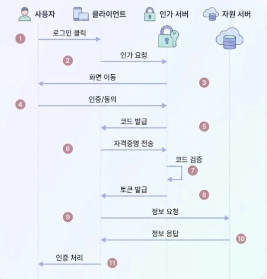

# Refresh Token

### Access Token의 만료 시간 딜레마

AT 만료시간을 짧게 잡으면 보안적 측면에서 좋다. 탈취당해도 만료가 금방 되기 때문이다. 하지만 이러면 UX(사용자 경험)이 매우 나빠진다.

그럻다면 AT 만료시간을 길게 잡으면 어떨까? 반대로 보안에 매우 취약하게 된다.

→ AT 만료시간을 짧게 유지하면서 재로그인 빈도도 적게 할 순 없을까?

### Refresh Token

AT 재발급 엔드포인트 전용으로 쓰인다. 재발급 시점에만 전송되어 노출 위험이 낮다.

1. 로그인이 성공하면 AT, RT가 동시에 응답한다.
2. 모든 API 호출에는 일단 AT가 사용된다. RT는 안전한 곳에 보관된다.
3. AT가 만약 만료되어 API 호출에 실패한다면
4. RT 전송을 통해 새로운 AT를 재발급한다.
5. 그 후 실패한 API 호출을 재시도한다.
6. RT가 만료되면 로그아웃된다.

만약 낮은 확률로 RT가 탈취된다면…

→ RT는 수명이 길기 때문에 공격자가 마음껏 활용이 가능하다. 또한 RT로 무한정 AT 발급이 가능하며, RT가 탈취된 것인지에 대한 여부를 서버는 알 수 없다.

### RTR (Refresh Token Rotation)

모든 RT는 1회용으로 바뀐다. 클라이언트가 RT로 새로운 AT를 요청하면, 서버는 새 AT와 함께 새 RT도 발급해준다. 이전 RT는 사용한 즉시 무효화되는 것이다.

1. 만약 공격자가 RT1으로 재발급을 요청한다. RTR에 의해 AT2, RT2가 발급될 것이다.
2. 이때 정상 사용자가 RT1으로 재발급을 요청한다.
3. 서버는 이미 사용된 RT1으로 또 다시 요청이 온 것을 감지한다.
4. 서버는 사용자에게 발급된 RT를 전부 무효화한다.
5. 따라서 공격자, 정상 사용자 모두 로그아웃되어 재로그인이 필요하다. 정상 사용자는 자신의 id, pw를 이용하여 로그인하겠지만, 공격자는 더 이상 활동이 불가하다.

RTR을 구현하기 위해서는 서버가 어떤 RT가 유효한지, 어떤 RT가 이미 사용되었는지를 알아야 한다. 그래서 이 두 가지 정보를 저장할 방법을 구상해야 한다.

### Redis

디스크 기반 관계형 DB는 I/O가 발생하여 상대적으로 느리다. 별도 스케쥴러가 필요하여 운영 코드가 증가하며 잦은 갱신에 취약하다. Redis는 인메모리 DB이기 때문에 메모리에서 처리하여 매우 빠르다. TTL을 기본 지원하기 때문에 별도의 로직이 필요하지 않다. 또한, RTR은 한 번 쓰고 버리는 것인데, 굳이 오래 저장할 수 있는 디스크 DB가 필요하지 않다. 휘발성 DB인 Redis가 매우 유리하다.

## Stateless인가?

RTR이 정상 요청인지 알려면 서버가 정보를 저장하는데, 이것이 Stateless는 아니지 않을까?

부분적으로 맞다. 빈도가 높은 일반 API 요청 처리는 Stateless가 맞다. 하지만 RT 재발급을 처리하는 과정은 Stateful이 맞다. 하지만 RT 재발급은 짧은 시간이기 때문에 완전한 Stateless는 아니지만 충분히 쓸 만한 가치가 있다.

# OAuth 2.0

사용자가 우리 서비스에 비밀번호를 직접 알려주지 않고, 신뢰할 수 있는 외부 서비스를 통해 신원을 증명하고 일부 권한을 우리 서비스에 위임하는 프로토콜을 말한다.

새 서비스마다 그 서비스의 회원가입이 불필요하다. 서비스에 비밀번호를 알려주지 않아도 되며 기억해야 할 비밀번호가 줄어든다. 구글, 네이버 이런것만 알아두면 수많은 사이트의 아이디 비번을 외울 필요 없이 간편하게 서비스를 사용할 수 있다. 잘 알려진 인증 주체를 통한 신뢰성 확보 역시 존재한다.

가입 단계가 단축되어 새 사용자를 모을 수 있다. 가입이 복잡하면 등 돌리기 마련이다… 또한 우리는 사용자 정보를 즉시 확보할 수 있고, 보안 사고 시 책임 영역이 분산된다. 우리같은 백엔드 개발자의 책임이 줄어든다.

1. 사용자가 Google로 로그인을 클릭한다.
2. 내 서버(OAuth Client)는 로그인 요청을 Google Auth Server로 Redirect한다.
3. Auth Server는 사용자 브라우저를 Google 로그인 페이지로 Redirect한다.
4. 사용자는 Google 로그인 화면에서 직접 로그인 한다.
5. Auth Server는 사용자를 우리 서버로 Rredirect하는데, 이때 URL Query Parameter로 일회용 임시 코드를 실어 보낸다. 이 코드는 수명이 짧고 한 번 사용되면 만료된다.  (토큰이 브라우저를 거치지 않게 전송한다.)
6. 이 코드를 받은 우리 서버는 이 코드로 Google Auth Server에 AT를 요청한다. 이 AT는 리소스 서버에 요청할 때 필요한 토큰이다.
7. Auth Server가 임시 코드가 맞는 코드인지 검증한다.
8. 통과하면 우리 서버에 AT를 발급해준다.
9. 우리 서버는 AT로 Google Resource Server에 사용자 정보를 요청한다. 이 Access Token의 주인이 누구인지 식별한다.
10. Resourve Server는 사용자 프로필 정보를 json 형식으로 응답한다.
11. 우리 서버는 해당 프로필 정보로 적절한 인증을 처리한다. 신규 유저라면 해당 사용자를 생성해야 하고, 기존 유저라면 토큰/세션을 자체적으로 발급해줘야 한다.

### TODO

Google Cloud Console에서 OAuth 프로젝트를 생성한 뒤, 우리 서비스를 등록해야 한다. 여기서 Secret Key를 발급해준다. Redirect URI를 등록하여야 하고 요청 권한 범위인 scope를 설정한다.

우리 서버 (OAuth Client)에서는 Secret Key로 안전하게 보관한다. 식별이 완료되면 우리 서비스에 맞게 자체 인증 상태로 전환한다.

### 활용

- 자체 회원가입 + 세션 → 가장 단순하며 소규모 서비스에 적합하다.
- 자체 회원가입 + AT/RT/RTR → Scale Out같은 분산 환경에 적합하다.
- OAuth + 세션 → 외부 로그인을 통한 단순화 + 보안적 측면에서 우수하다.
- OAuth + AT/RT/RTR → 대규모 분산 환경에서 적합하다.